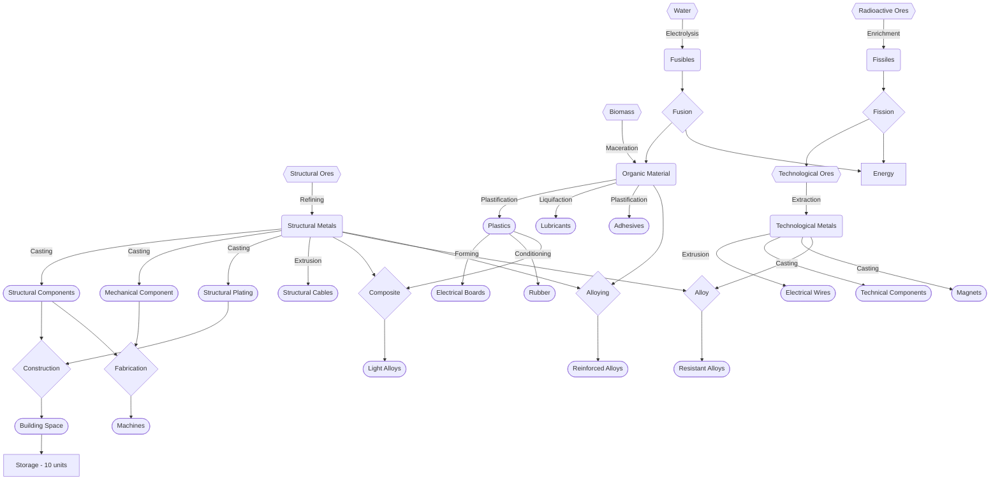

# Summary

## Raw Materials
These are what is most commonly found. Some exception exist, like stars, and Jovians which have large quantities of Fusibles instead of water, or some asteroids which have Structural and Technological Metal already refined. 1 Unit used here is equal to 100 kg of material.

- Water
- Biomass
- Structural Ore
- Technological Ore
- Radioactive Ore

## Refined Material
While some of these can be found naturally, most require some amount of refining or purification to get them out of their source 'ores'.

- Fusibles - Matter which has little use beyond being fused for energy.
- Organic Matter - Light materials and non-metal elements.
- Structural Metal - Iron and similar Metals.
- Technological Metal - Gold, Silver, and similar highly conductive metals which can be used for particular ends.
- Fissiles - Refined Radioactive material which can be used as reaction material and produce energy.

## Intermediate Products
Various secondary goods which are created and used to produce other things. These have no direct use in and of themselves.

- ## Intermediate Parts
  - Structural Components
    - Strucutral Parts, designed to shield from the environment or bear a load.
    - 1 Structural Metal -> 1 Structural Component
  - Mechanical Components
    - Gears, Screws, Driveshafts, and similar parts which are used to transfer mechanical power.
    - 1 Structural Metal -> 1 Mechanical Components
  - Oil
    - Liquified and highly energetic organic matter.
    - 1 Organic Matter -> 1 Oil
  - Plastic
    - Material made out of various carbon chains and the like.
    - 1 Oil -> 1 Plastic
  - Lubricants
    - Slippery substances used to keep machines cool while working.
    - 1 Oil -> 1 Lubricant
  - Carbon Block
    - Refined Carbon, used for carbon based materials.
    - 1 Organic Matter -> 1 Carbon Block
  - Diamonds
    - Compressed and Annealed Carbon. Very strong.
    - 1 Carbon Block -> 1 Diamond
  - Nanotubes
    - An advanced form of Carbon, forming molecular threads of high strength.
    - 1 Carbon Block -> 1 Nanotubes
  - Wires
    - Common Electrical wires, typically made of copper and other materials.
    - 1 Technological Metal -> 1 Wires
  - Motor
    - An Electric Motor, capable of moving things around through electrical power.
    - 1 Wires + 1 Mechanical Component + 1 Lubricant -> 3 Electric Motor
  - Technical Components
    - Various parts and components used in electrical and computational applications.
    - 1 Technological Metal -> 1 Technical Components
  - Basic Processor
    - A simple General Purpose Computation Unit, turing completed, but otherwise entirely inert.
    - 1 Wires + 1 Plastic + 1 Technical Components -> 3 Basic Processors
  - Personality Core Components
    - A highly advanced, parallel processing core, capable of being animated by your personality, or 
    - 1 Basic Processors + 5 Wires + 4 Techincal Components -> 10 Personality Core Components
  - Electromagnets
    - Electromagnetic Components which have various purposes.
    - Structural Metal + Technical Metal -> Electromagnets
  - Fusion Reactor Components (10000 kg for 1 reactor)
    - A complex and powerful source of energy which can be fed by Fusibles, which are among the most abundant resource in the Galaxy.
    - 5 Electromagnets + 3 Wires + 1 Structural Components + 1 Basic Processor -> 10 Fusion Reactor Components
  - Steam Turbine Parts
    - Parts for power generator which absorbs energy from hot steam to produce electricity.
    - 1 Mechanical Components + 1 Structural Component + 1 Motor -> 3 Steam Turbine Parts
- ## End Products and Buildings
  - Building Space
    - Generic building, used for everything else.
    - 10 Structural Components -> 1 Building Space
  - Warehouse (Component)
    - Turns a building space into an empty warehouse, can hold N * 100 * 1.1^N goods for each Warehouse component attached to the building.
    - 1 Building Space -> 1 Warehouse
  - Fusion Reactior
    - High efficiency, with cheap and plentiful fuel. It's cost comes in it's inherestly large size, low scaling efficiency, and highly complex construction.
    - 10 Building Space + X Fusion Reactor Components -> Fusion Reactor
  - Fission Reactor
    - Moderate Efficiency, fuel is relatively expensive and rare, but highly efficient. It's construction is also fairly simple, a containing structure and small control mechanism.
  - Steam Engine
    - Low Efficiency, but capable of burning Organic Matter and Biomatter for energy.
  - Combustion Engine
    - Moderate Efficiency, capable of burinng liquid fuels. It's greatest strength is it's small size per power output.
  - Photoelectric Cell
    - Light which hits it is absorbed. A portion dissipates into heat, the rest is converted into Energy. It also imparts a change in momentum to the object.
  - Mirror 
    - Designed to recieve and reflect light. Gets double the momentum change of the Photoelectric Cell, and has a lower heat loss coefficient.
  - Heat Sink (Component)
    - A part of a building or ship which increases heat dissapation for the body.
  - Cooling Tower
    - A more proactive heat sink, it expends some energy (creating more thermal energy) to move an even larger quantity of thermal energy into it's heat sink, allowing it to dissapate energy more efficiently.

